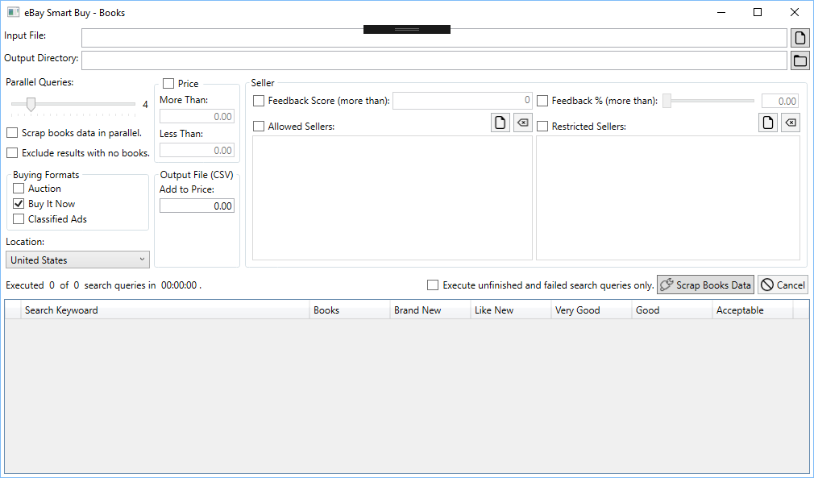
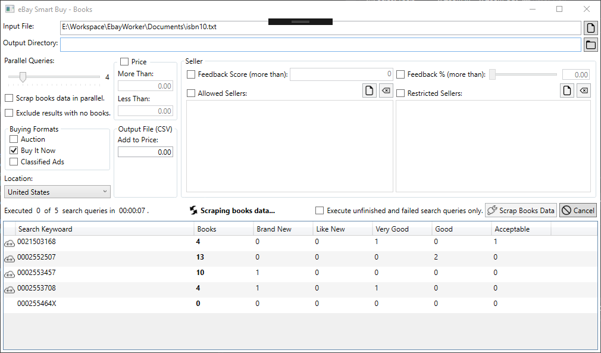

# eBay Smart Buy - Books

It is a simple program which will allow one to scrap books data from eBay listings. This data may be useful for merchants who sell books on various online stores after purchasing used or new books from eBay on competitive prices. Data is exported in CSV file format with single book detail per line. It takes a file with ISBN10 or ISBN16 book codes with one ISBN per line as input.

## Application Features
* Parallel data scraping with upto 20 books simultaneously.
* Search results with no book data can be excluded.
* Selection of buying formats from *Auction*, *Buy It Now* and *Classified Ads*.
* Selection of eBay site to scrap data from i.e. US, Canada and UK.
* Filteration based on book price, seller feedback score and feedback percent.
* Restrict and/or allow data from selected sellers.
* Option to open eBay page from where data is scraped.
* Option to execute only unfinished and failed search queries.

## Want to contribute?
I am doing this project in my free time and giving it for **free**. The best way to contribute is by donating me money [here](https://www.paypal.com/cgi-bin/webscr?cmd=_s-xclick&hosted_button_id=N2NGKMAA4Y9QU) which will help me pay eletricity bills and compensate time spent on its development. You can also contribute by suggesting new features and reporting issues [here](https://github.com/waliarubal/EbayWorker/issues).

## Screenshots

## Want to download?
You can download the latest release from the [releases page](https://github.com/waliarubal/EbayWorker/releases/latest). This is a *Microsoft Windows only software* and will work with all versions ranging from  Windows XP (SP2) to Windows 10.
